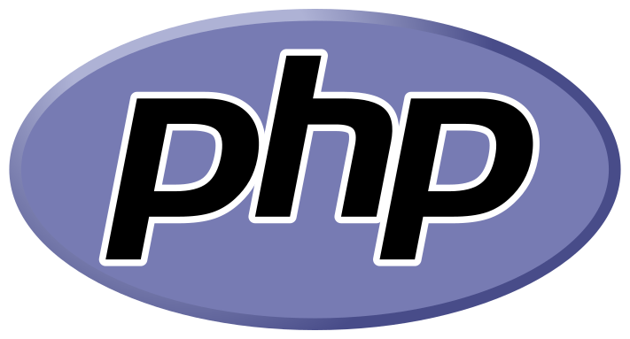

# 👋 ¡Hola! Soy Bryan Castaño
<em><small>Desarrollador Full Stack – Java · Spring Boot · JavaScript · React · WordPress · PHP</small></em>

Soy un **desarrollador full stack** con experiencia en **Java, Spring Boot,JavaScript, React, WordPress y PHP**, especializado en construir soluciones web completas y optimizadas.  
Me gusta crear interfaces atractivas, optimizar el rendimiento y aprender tecnologías que me permitan aportar más valor en cada proyecto.

---

## 🚀 Proyectos destacados
- **Tienda Online Full Stack** — Java, Spring Boot, React, Git  
  Backend y frontend completos: gestión de productos, usuarios y pedidos.
- **App de Evaluación de Candidatos** — React + Spring Boot  
  Implementación de lógica de evaluación (vectorización) y API en Spring Boot.
- **Webs a medida con WordPress/PHP** — Integración de APIs, optimización y gestión de hosting/DNS.
- **Portales y eCommerce** — Digitalización e integración para administraciones y empresas.

---

## 🛠 Tecnologías

### Backend

  
  
  
  
  

### Frontend

  
  
  
  

### Bases de datos

  
  

### Herramientas

  
  
  

---

## 📚 Formación en curso

  
  

- Profundizando en **JUnit 5** para testing automatizado.  
- Aprendiendo **Python** para ampliar capacidades backend.  
- Mejorando **inglés técnico** con el objetivo de certificar nivel.

---

## 📈 Estadísticas
|  |  |
| --- | --- |

---

## 📫 Contacto
- 🌐 [bryancas.com](https://bryancas.com)
- 💼 [LinkedIn](https://www.linkedin.com/in/bryan-castaño-san-segundo)
- ✉️ **bryan.sanse@gmail.com**

<small><em>Siempre aprendiendo, siempre creando.</em></small>

